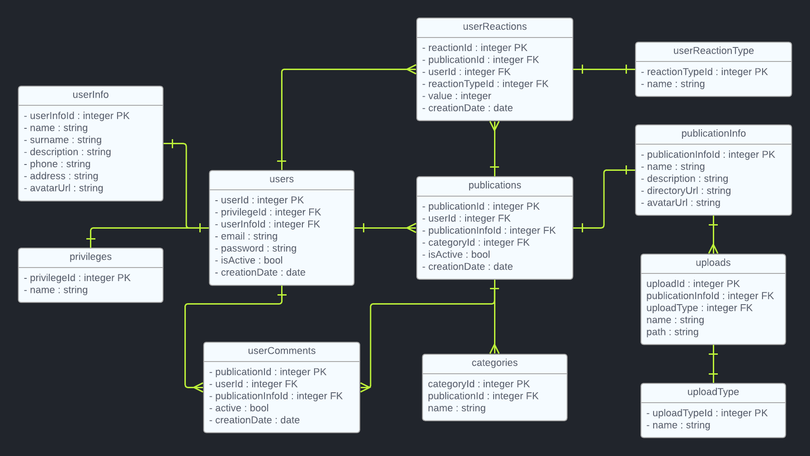

## Cel projektu

Za cel obraliśmy sobie stworzenie platformy o nazwie SkillSage, zawierającej poradniki dla użytkowników chcących poszerzać swoje umiejętności w każdym zakresie. Chcemy trafić głównie do osób, które pracują fizycznie i chciałyby się nauczyć, poszerzyć widzę lub podzielić swoimi doświadczeniami. Nie chodzi nam jednak tylko o to. Nasza platforma ma służyć jak najlepiej każdemu, niezależnie od wieku czy umiejętności. W oparciu o problemy z poradnikami wideo, z których wiedza często umyka nam bardzo szybko, postanowiliśmy wprowadzić możliwość dodawanie instrukcji w formie pisemnej (pdf/doc/itp...). Od dzisiaj wszyscy jesteśmy się w stanie doskonalić w sposób jaki nam się tylko podoba! :D

### Zaimplementowane technologie

React - biblioteka JavaScript do budowy interfejsów użytkownika. Pozwala programistom na tworzenie komponentów interfejsu, które są dynamiczne i reagują na zmiany danych. React wykorzystuje wirtualny DOM do efektywnego renderowania tylko zmienionych części interfejsu, co przyczynia się do szybkiego i płynnego działania aplikacji. React jest często stosowany w tworzeniu jednostronicowych aplikacji internetowych (SPA).

TypeScript - rozszerzenie języka JavaScript, które dodaje statyczną typizację. Programiści używają TypeScript do zwiększenia bezpieczeństwa kodu poprzez określenie typów danych. TypeScript kompiluje się do zwykłego JavaScript, co oznacza, że może być używany wszędzie tam, gdzie JavaScript. Jest często wykorzystywany w projektach, gdzie wymagane jest surowe typowanie i praca z większymi zespołami programistycznymi.

Tailwind CSS - framework CSS oparty na klasach. Zamiast definiować własne reguły CSS, programiści używają klas dostarczanych przez Tailwind, które mapują się na konkretne style. Jest to podejście oparte na komponentach, co pozwala na szybkie i konsekwentne tworzenie interfejsów użytkownika. Tailwind jest elastyczny, co umożliwia dostosowywanie projektu do indywidualnych potrzeb.

Django - framework webowy napisany w języku Python. Zapewnia narzędzia do szybkiego tworzenia skalowalnych aplikacji internetowych. Django używa wzorca architektonicznego Model-View-Controller (MVC) i obejmuje wiele wbudowanych funkcji, takich jak obsługa użytkowników, zarządzanie bazą danych, obsługa formularzy, bezpieczeństwo i wiele innych. Jest ceniony za swoją czytelność, prostotę i gotowe rozwiązania, które przyspieszają rozwój aplikacji webowych.

PostgreSQL - potężny, otwartoźródłowy system zarządzania bazą danych relacyjnych. Posiada wiele zaawansowanych funkcji, takich jak transakcje, klucze obce, indeksy, widoki i triggery. PostgreSQL obsługuje standardowy język zapytań SQL oraz oferuje rozszerzenia, które umożliwiają bardziej zaawansowane operacje i funkcje.

### Struktura oraz architektura aplikacji

...

### Diagram ERD

### Diagram UML

...

### Figma

Figma to zaawansowane narzędzie do projektowania interfejsów użytkownika i tworzenia prototypów dostępne online. Umożliwia projektowanie UI, tworzenie interaktywnych prototypów, współpracę w czasie rzeczywistym, udostępnianie projektów poprzez linki, tworzenie prezentacji i zarządzanie bibliotekami komponentów. Dzięki łatwości użytkowania i elastyczności, Figma jest popularnym wyborem wśród projektantów interfejsów użytkownika.

[Aby zobaczyć całość naszej pracy, kliknij w ten link](https://www.figma.com/file/L3i79TFSb0BXJoesKHpLaH/Untitled?type=design&node-id=0%3A1&mode=design&t=slJUzth9BLML7q9f-1)

## Format Pracy

#### Git workflow to sposób organizacji pracy z systemem kontroli wersji Git. Istnieje wiele różnych podejść do tego, ale jednym z popularnych modeli jest GitFlow. Oto krótka informacja na temat działania GitFlow:

- Głównym elementem GitFlow są dwie gałęzie: "master" i "develop". Gałąź "master" zawiera stabilny kod produkcyjny, natomiast gałąź "develop" służy do integracji kodu.

- Aby rozpocząć pracę nad nowym zadaniem, tworzymy gałąź funkcji od gałęzi "develop". Ta gałąź jest tworzona dla każdej nowej funkcji, której praca jest rozpoczynana.

- Kiedy praca nad funkcją zostanie ukończona, gałąź funkcji jest scalana z gałęzią "develop". W ten sposób wprowadzamy zmiany do głównej gałęzi projektu.

- Przed wprowadzeniem zmian z gałęzi "develop" do "master" tworzona jest gałąź "release". Na tej gałęzi dokonywane są ostatnie poprawki, testy i przygotowania przed wydaniem nowej wersji.

- Po zakończeniu prac na gałęzi "release", jest ona scalana z gałęzią "master", a także z gałęzią "develop". Dodatkowo, po scaleniu z gałęzią "master", oznaczamy ten punkt jako nową wersję oprogramowania.

- Jeśli wystąpią błędy lub problemy po wydaniu wersji, naprawki są wykonywane na gałęzi "hotfix". Gałąź "hotfix" jest tworzona bezpośrednio z gałęzi "master", aby umożliwić szybkie wprowadzenie poprawek do stabilnej wersji.

- Po naprawieniu błędu na gałęzi "hotfix", zmiany są scalane z gałęzią "master" i "develop". Po scaleniu z "master" oznaczamy ten punkt jako nową wersję.

GitFlow pomaga w zorganizowaniu pracy zespołu, umożliwiając równoczesne tworzenie nowych funkcji, poprawki błędów oraz utrzymanie stabilnej wersji produkcyjnej.

##### Z racji poziomu zaawansowania projektu oraz faktu, iż jest to dopiero prototyp, ominiemy gałęzie takie jak release oraz hotfix.

## Bezpieczeństwo aplikacji

...

## Opis widoków

...

## Kierunek rozwoju

...

## Dodatkowe informacje

...
